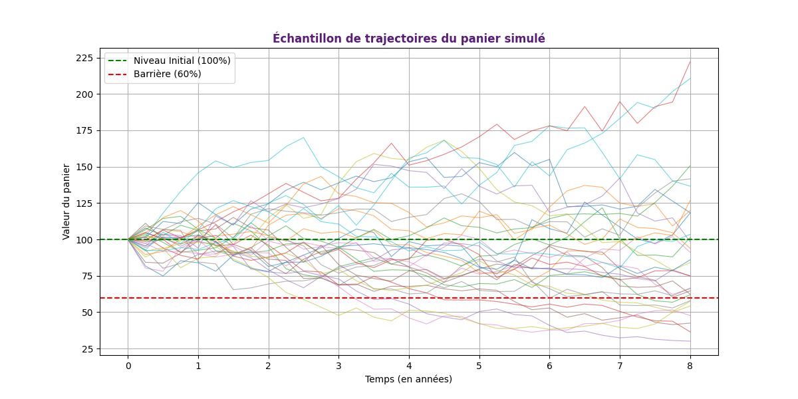

Ce projet simule la valorisation d'un projet structuré autocallable inspiré d'un produit de Natixis actuellement en vie nommé "Objectif LVMH / BNP / TOTAL / SANOFI Mars 2025" (https://equityderivatives.natixis.com/fr/products/fr001400wmu6/).

Le projet reprend quelques éléments associés à la brochure de cet autocall :
  - sous-jacent basé sur un panier de 4 actions
  - maturité à 8 ans
  - observation trimestrielle à partir du 5e trimestre
  - gain de 1,525% par trimestre
  - gain final de 48,8%
  - barrière d'autocall à 100%
  - barrière de protection à 60%
  - valeur nominale de 1000€

Remarques : Le cours et la volatilité des 4 actions, le taux sans risque, le taux de corrélation et le rendement de dividende moyen ont été choisis arbitrairement, par souci de simplicité et lisibilité du code.

L'objectif du code est dans un premier temps de simuler les trajectoires des 4 actifs corrélés à l'aide d'un modèle de diffusion géométrique brownien. Puis le code donne la moyenne des actifs pour chaque simulation et chaque observation pour former un panier.
Un graphique est généré afin de visualiser 30 trajectoires du panier simulé, sans tenir compte de la barrière d'autocall à chaque trimestre (la simulation continue même si le panier dépasse les 100% de sa valeur initiale)

Ensuite, le code calcule les payoffs pour chaque simulation en fonction des conditions d'autocall et de la valeur finale du panier, puis actualise ces payoffs. Le code estime également le prix de l'autocall par Monte Carlo (10 000 simulations)
Ces éléments sont affichés sur le graphique ci-dessous :

En soustrayant le prix estimé au prix d'émission de 1000€ (donné par la brochure officielle de l'autocall), le code essaie d'estimer une marge implicite fictive.
La fin du code prend en charge la vérification de la cohérence des résultats :
  - le payoff maximal actualisé donné par le code est bien celui obtenu par le calcul (1000*148,8%*exp(-0,02*8) ≃ 1268€)
  - la maturité associée à ce payoff maximal est de 8 ans
  - parmi les 10 000 simulations, le nombre de simulations impliquant un remboursement anticipé au 5e trimestre confirme la justesse du graphique de la distribution des payoffs actualisés
